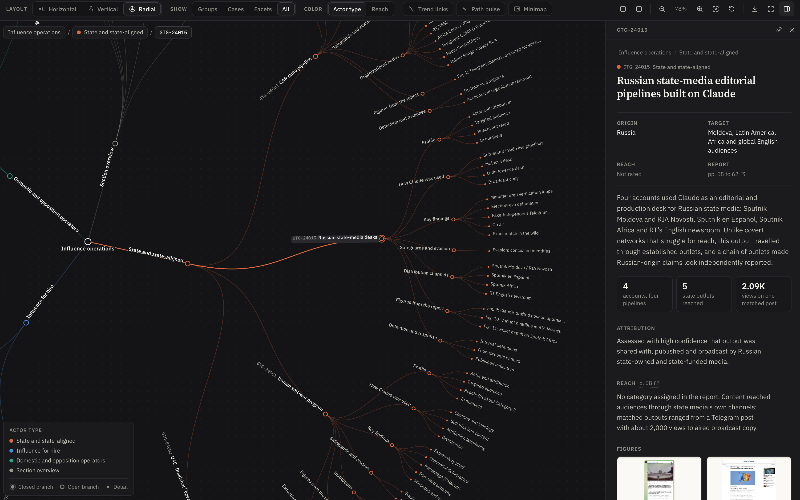

# Influence Operations on Claude

An interactive map of the influence operations section of Anthropic's threat intelligence report, *Detecting and countering misuse of AI: September 2026* (pages 41 to 80).

**Live site:** https://stvsever.github.io/ThreatIntelligence_InfluenceOperations_AnthropicReport/



## What it shows

- **Nine disrupted operations**, grouped by who ran them: state and state-aligned actors, commercial influence-for-hire firms, and domestic or opposition operators.
- **One consistent structure per case**: profile, how Claude was used, key findings, safeguards and evasion, network, figures, and detection and response.
- **All 18 figures** from the section, extracted unaltered from the PDF.
- **Comparative views**: reach on the Breakout Scale, a trend-by-case matrix and a sortable case index.
- **Traceable text**: every statement links to its page in the report.

## Using the map

| Action | Result |
| --- | --- |
| Click a node | Select it and open its branch; click again to collapse |
| Shift-click | Expand or collapse the whole branch |
| Drag canvas / node | Pan the view / move a branch |
| Scroll or pinch | Zoom |
| `1` `2` `3` | Horizontal, vertical or radial layout |
| `/` | Search actors, tactics, outlets and indicators |
| `?` | All keyboard shortcuts |

The toolbar also covers depth presets, color by actor type or reach, trend links, the root-to-selection path pulse, a minimap, light and dark themes, and SVG or PNG export. Every view has a shareable URL.

## Run locally

The site is plain HTML, CSS and JavaScript with no build step or dependencies.

```bash
python3 -m http.server 8000 --directory src/dashboard
```

Then open http://localhost:8000.

To extract the figures from the PDF again:

```bash
pip install -r requirements.txt
python src/scripts/extract_figures.py
```

## Project structure

```
src/
  dashboard/                 Static site published to GitHub Pages
    index.html
    css/styles.css
    js/data.js               Content model: paraphrased case data with page references
    js/tree.js               Builds the navigable hierarchy
    js/graph.js              Tree renderer: layouts, zoom, drag, pulse, minimap, export
    js/panel.js              Details panel
    js/views.js              Case index, figure gallery, method page, lightbox
    js/app.js                Controls, search, routing and theme
    assets/figures/          Figures 1 to 18 from the report
  report/                    Source PDF
  scripts/extract_figures.py Figure extraction (byte-for-byte JPEG copy)
```

## Deployment

A GitHub Actions workflow publishes `src/dashboard` to GitHub Pages on every push to `main` once the repository is public. Set **Settings > Pages > Source** to **GitHub Actions**.

## Sources

- Anthropic Threat Intelligence (2026). [Detecting and countering misuse of AI: September 2026](https://www-cdn.anthropic.com/e50be2e51e7695dc4b1366a37a245a597377d3b5/Anthropic-Detecting-and-countering-091026.pdf).
- Nimmo, B. (2020). [The Breakout Scale: Measuring the impact of influence operations](https://www.brookings.edu/articles/the-breakout-scale-measuring-the-impact-of-influence-operations/). Brookings Institution.

## Disclaimer and license

This is an independent project, not affiliated with or endorsed by Anthropic. Report text is condensed and paraphrased with page references. The report and its figures remain the property of Anthropic and are reproduced for commentary and research.

The code is released under the [MIT License](LICENSE); the license does not cover the report or its figures.

Author: Stijn Van Severen
